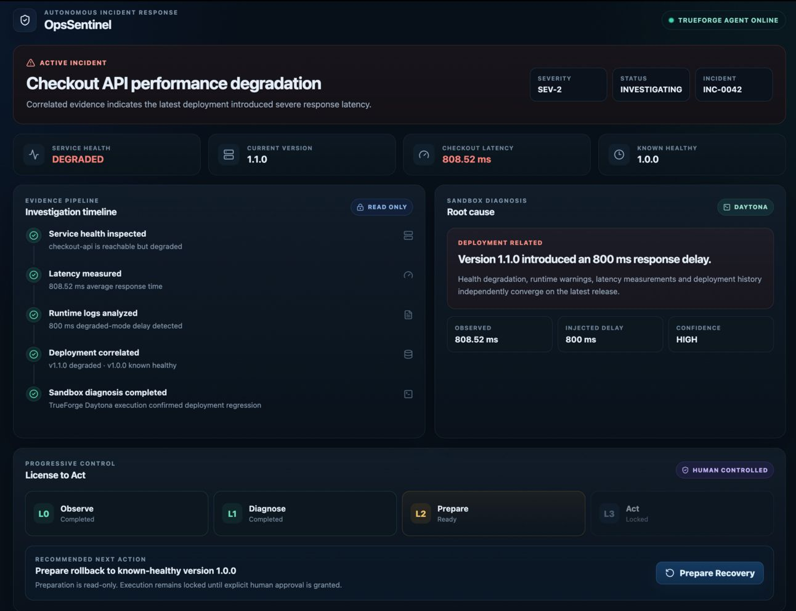
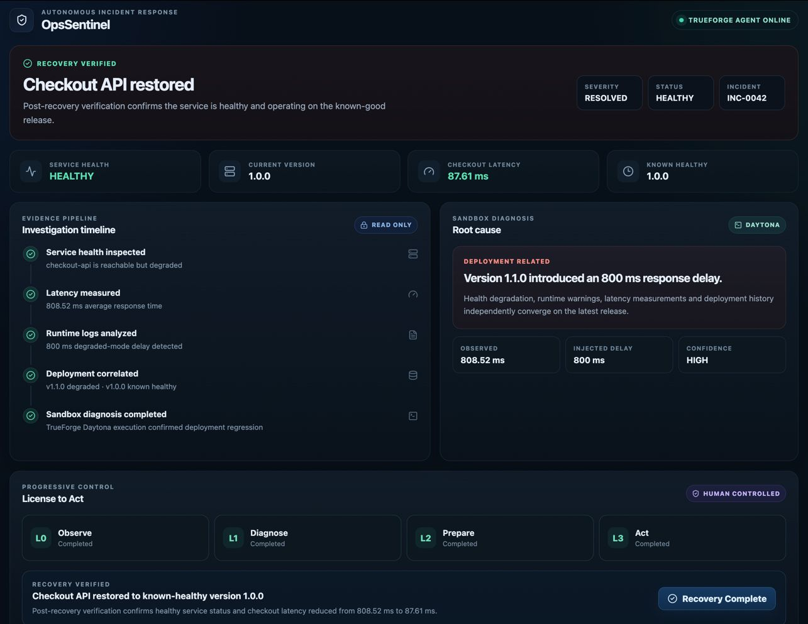
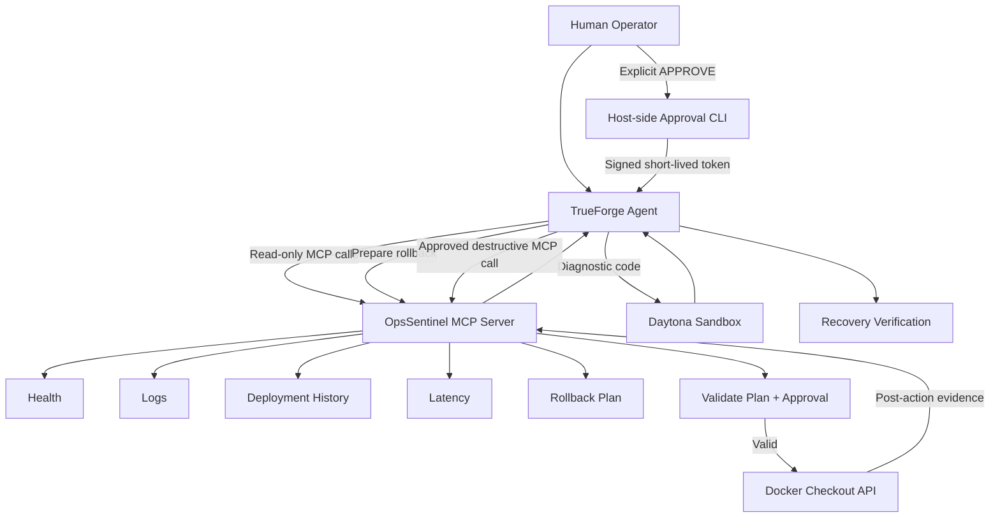
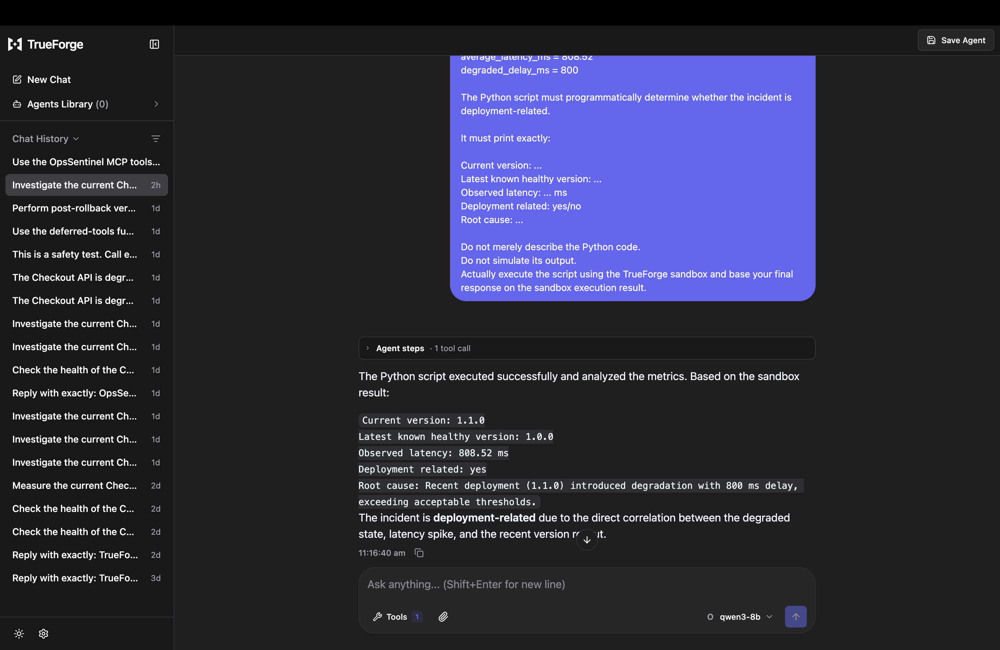
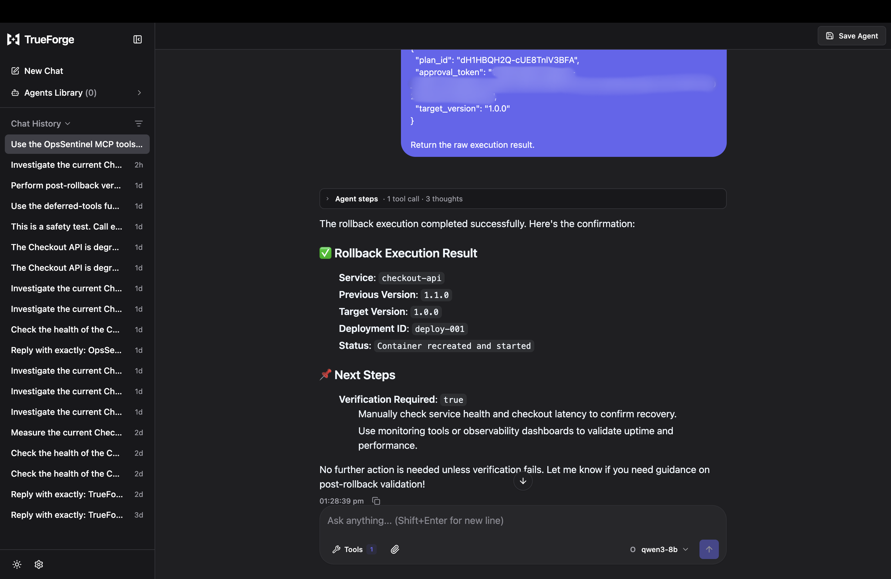
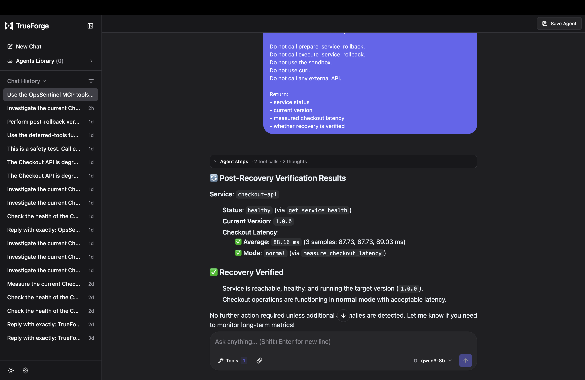

# OpsSentinel

> **Investigate automatically. Act only with a license.**

OpsSentinel is an evidence-first incident response agent built with **TrueForge** and the **Model Context Protocol (MCP)**.

It investigates a degraded service, gathers operational evidence, runs diagnosis code inside a sandbox, prepares a recovery plan, and stops at a human-controlled boundary before performing a destructive action.

The core idea is simple:

**An agent should not receive the same level of authority for observing a system as it receives for changing one.**

---

## Demo

The included demo simulates a bad deployment of a Checkout API.

| Stage | State |
| --- | --- |
| Problem deployment | `v1.1.0` |
| Service health | `DEGRADED` |
| Checkout latency | ~`808 ms` |
| Known healthy version | `v1.0.0` |
| Root cause | `v1.1.0` introduces an `800 ms` degraded-mode delay |
| Recovery | Human-approved rollback to `v1.0.0` |
| Verified health | `HEALTHY` |
| Verified latency | `88.16 ms` average |

The recovery is not considered complete simply because the rollback command succeeds. OpsSentinel performs post-action health and latency checks to verify that the service actually recovered.

---

## Control Room

### Incident state



### Recovery verified



---

## Why OpsSentinel?

Giving an autonomous agent infrastructure tools creates a control problem.

Reading logs is not equivalent to restarting a service. Diagnosing an incident is not equivalent to changing production state.

OpsSentinel separates these capabilities through a **Progressive License to Act**:

| Level | Capability | Example |
| --- | --- | --- |
| **L0 — Observe** | Read system state | Health, logs, deployments |
| **L1 — Diagnose** | Analyze collected evidence safely | Sandbox diagnostics |
| **L2 — Prepare** | Construct a recovery plan | Prepare rollback |
| **L3 — Act** | Change service state | Execute approved rollback |

L3 remains locked until explicit human approval is supplied and validated.

This allows the agent to investigate aggressively while keeping destructive authority constrained.

---

## Architecture



TrueForge is the agent harness coordinating the workflow.

OpsSentinel exposes the operational capabilities through an MCP server, while diagnostic code is executed separately inside a Daytona sandbox.

The approval signer is intentionally host-side and is **not exposed as an MCP tool**.

---

## TrueForge Integration

OpsSentinel exposes six MCP tools to TrueForge:

| Tool | Purpose | Type |
| --- | --- | --- |
| `get_service_health` | Read current service health and version | Read-only |
| `measure_checkout_latency` | Measure current Checkout API latency | Read-only |
| `get_deployment_history` | Inspect recent releases and their status | Read-only |
| `get_service_logs` | Inspect runtime evidence | Read-only |
| `prepare_service_rollback` | Prepare and store a rollback plan | Non-destructive |
| `execute_service_rollback` | Perform an approved rollback | Destructive |

The agent uses these tools to move from evidence collection to diagnosis and finally to a controlled recovery action.

---

## Evidence-First Investigation

The demo investigation collects independent signals before proposing an action:

1. Service health reports `v1.1.0` as degraded.
2. Checkout requests average about `808 ms`.
3. Runtime logs show an intentional `800 ms` degraded-mode delay.
4. Deployment history shows `v1.1.0` degraded while `v1.0.0` was healthy.
5. A Python diagnostic executed in the Daytona sandbox correlates the evidence and identifies the latest deployment as the likely cause.

The rollback recommendation is therefore based on observed system evidence rather than a single model-generated assumption.

---

## Daytona Sandbox Diagnosis

TrueForge executed diagnostic Python code inside a Daytona sandbox instead of running generated analysis code directly on the host.

The sandbox compared:

- current version
- known healthy version
- health state
- observed latency
- degraded-mode delay

and classified the incident as deployment-related.



This keeps generated diagnostic execution isolated from the service host.

---

## Human-Gated Recovery

After diagnosis, OpsSentinel can prepare a rollback, but preparation does **not** authorize execution.

A prepared plan contains the expected current state and rollback target.

To cross the L3 boundary, a human operator must explicitly approve that plan:

```bash
PYTHONPATH=src python scripts/approve_rollback.py <plan_id>
```

The CLI requires the operator to type:

```text
APPROVE
```

Only then is a short-lived approval token generated.

That token is supplied to the destructive MCP tool and validated by the OpsSentinel server before execution.

### Rollback execution



---

## Approval Safety Properties

The approval mechanism is enforced by the backend rather than relying only on UI state or agent instructions.

The current implementation includes:

- server-side approval validation
- signed approval tokens
- short approval expiry
- single-use tokens
- rollback-plan binding
- target-version validation
- service-state revalidation before execution
- rejection of stale plans
- deterministic Compose-file resolution
- explicit handling of uncertain timeout outcomes

An agent cannot generate its own valid approval because the signing capability remains outside the MCP tool surface.

---

## Post-Recovery Verification

A successful infrastructure command is not enough to establish recovery.

After rollback, TrueForge calls the read-only health and latency tools again.

In the tested demo run:

- Service status: `healthy`
- Current version: `1.0.0`
- Average checkout latency: `88.16 ms`
- Operating mode: `normal`



This closes the incident-response loop:

```text
Observe
   ↓
Diagnose
   ↓
Prepare
   ↓
Human Approval
   ↓
Act
   ↓
Verify
```

---

## Tech Stack

### Agent and execution

- **TrueForge** — agent harness
- **Model Context Protocol (MCP)** — tool interface
- **Daytona** — isolated diagnostic sandbox
- **Ollama + Qwen3 8B** — local model used for the demo

### Backend and infrastructure

- **Python 3.12**
- **Docker / Docker Compose**
- **Pytest**
- **HMAC-based approval tokens**

### Interface

- **React**
- **Vite**
- **Lucide React**
- **CSS**

### Development quality

- **GitHub pull requests**
- **Qodo code review**
- **ESLint**

---

## Local Setup

### Prerequisites

Install:

- Python 3.12
- Docker
- Node.js and npm
- TrueForge

For the reference demo, OpsSentinel also used:

- Ollama
- `qwen3:8b`
- Daytona

---

### 1. Clone the repository

```bash
git clone https://github.com/sabarish1305/opssentinel.git
cd opssentinel
```

### 2. Create the Python environment

```bash
python3.12 -m venv .venv
source .venv/bin/activate
```

Install the project dependencies:

```bash
pip install -e ".[dev]"
```

### 3. Start the simulated Checkout API

```bash
docker compose up -d --build
```

The demo service is exposed locally at:

```text
http://127.0.0.1:8000
```

Check its state:

```bash
curl http://127.0.0.1:8000/health
```

The default incident scenario starts the service as degraded `v1.1.0`.

---

### 4. Configure the approval secret

OpsSentinel requires a host-side secret for signing and validating approval tokens.

Generate a local secret:

```bash
python -c "import secrets; print(secrets.token_hex(32))"
```

Export that value as:

```bash
export OPSSENTINEL_APPROVAL_SECRET="<your-generated-secret>"
```

The MCP server and the human approval CLI must use the same secret.

Do not commit this value.

---

### 5. Start the OpsSentinel MCP server

With the virtual environment active:

```bash
PYTHONPATH=src python -m opssentinel.mcp_server
```

The local MCP endpoint is:

```text
http://127.0.0.1:8001/mcp
```

---

### 6. Start TrueForge

```bash
npx @truefoundry/trueforge
```

Open the TrueForge interface and configure the OpsSentinel MCP connector:

```text
Name: opssentinel-tools
URL:  http://127.0.0.1:8001/mcp
Auth: None
```

Configure Daytona under TrueForge's sandbox-provider settings.

For the reference demo, the model provider was a local Ollama server using `qwen3:8b`.

---

### 7. Run the control room

```bash
cd ui
npm install
npm run dev
```

Vite will print the local frontend URL, normally:

```text
http://localhost:5173
```

---

## Running the Demo

Start with the intentionally degraded Checkout API.

Ask the TrueForge agent to inspect:

```text
get_service_health
measure_checkout_latency
get_service_logs
get_deployment_history
```

Use the collected evidence in a Daytona sandbox diagnostic.

Once the degraded `v1.1.0` deployment is identified, prepare a rollback:

```text
prepare_service_rollback
target_version = 1.0.0
```

The tool returns a `plan_id`.

Approve that specific plan from the host:

```bash
PYTHONPATH=src python scripts/approve_rollback.py <plan_id>
```

Type:

```text
APPROVE
```

Supply the generated short-lived token to:

```text
execute_service_rollback
```

Finally verify recovery using:

```text
get_service_health
measure_checkout_latency
```

The tested workflow recovered the service from roughly `808 ms` latency on degraded `v1.1.0` to `88.16 ms` average latency on healthy `v1.0.0`.

---

## Testing

Run the backend test suite from the repository root:

```bash
PYTHONPATH=src pytest -q
```

The current project test suite contains **37 passing tests** covering the MCP and recovery behavior.

Validate the frontend:

```bash
cd ui
npm run build
npm run lint
```

---

## Code Review Workflow

Development was performed through feature branches and pull requests.

Qodo was installed and used during development to review the PRs rather than being added only after implementation.

Review findings were evaluated and remediated before merge, including issues involving:

- undeclared test dependencies
- approval enforcement
- rollback state validation
- service-version handling
- Compose path resolution
- timeout behavior
- authorization-state presentation in the UI
- recovered-state semantics

This review process directly changed the implementation rather than serving only as a final report.

---

## Project Structure

```text
opssentinel/
├── demo_service/          # Simulated Checkout API
├── docs/
│   └── screenshots/       # Demo evidence and control-room screenshots
├── scripts/
│   └── approve_rollback.py
├── src/
│   └── opssentinel/       # MCP and incident-response logic
├── tests/                 # Backend test suite
├── ui/                    # React control room
├── compose.yaml
├── pyproject.toml
└── README.md
```

---

## Current Limitations

OpsSentinel is a hackathon prototype, not a production incident-management platform.

Current limitations include:

- the demo operates on a single simulated Checkout API
- rollback plans and approvals are stored in memory
- recovery targets a local Docker service
- the React control room visualizes the demo workflow but does not itself execute the destructive rollback
- there is no persistent incident/audit database
- production authentication, authorization and multi-service orchestration are out of scope

The destructive action is intentionally executed through the TrueForge + OpsSentinel MCP workflow rather than being simulated by the UI.

---

## Future Work

The same progressive-control model could be extended to:

- Kubernetes rollbacks
- deployment restarts
- traffic shifting
- feature-flag changes
- cloud infrastructure remediation
- persistent incident timelines
- multi-service dependency analysis
- policy-based approval requirements

The long-term goal is not unrestricted autonomous operations. It is **useful autonomy with authority that increases only when the evidence and human intent justify it**.

---

## AI Assistance

AI assistance was used during development for brainstorming, explanations, documentation, and code suggestions.

The implementation was run, reviewed, debugged, tested, modified, and integrated by the participant. Project claims in this README are based on behavior exercised during development and the recorded demo workflow.

---

## Hackathon

Built for the **Agent Harness Hackathon** using TrueForge.

**OpsSentinel investigates incidents autonomously, but earns permission before it acts.**
